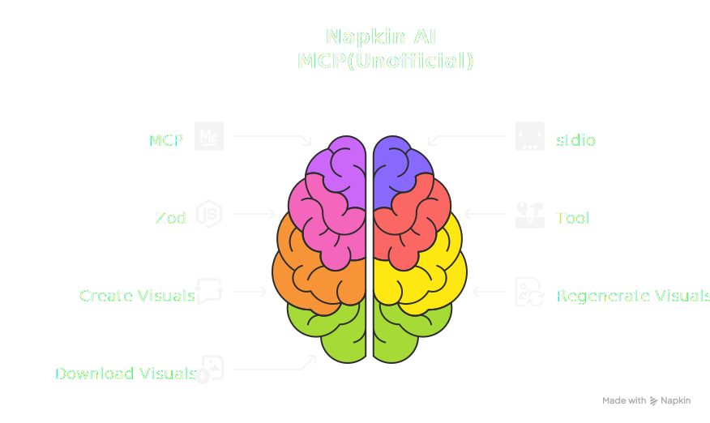

# Napkin MCP Server (Unofficial)



An MCP (Model Context Protocol) server that wraps the Napkin API (create/status/download) in a spec-driven way. 
It follows the split specs under `docs/specs/` (Types/Tools/Error Model) and uses Zod to define and publish strict input/output schemas.

> ⚠️ Disclaimer: 
This project is an unofficial community project and is not affiliated with, endorsed by, nor sponsored by Napkin AI. 
Napkin AI and any related marks are the property of their respective owners. 
Use of the Napkin API must comply with Napkin AI's Terms of Service, rate limits, and branding guidelines.

## Features
- Exposes Napkin as MCP tools (usable synchronously)
  - `napkin_create_visual_request` (POST /v1/visual)
  - `napkin_regenerate_visual` (POST /v1/visual, regenerate same-structure visuals with different text by `visual_id`/`visual_ids`)
  - `napkin_get_visual_status` (GET /v1/visual/{id}/status)
  - `napkin_download_visual_file` (returns download guidance + headers only)
- Zod schemas are published as JSON Schema via MCP `tools/list`
- Reflects Napkin API considerations (Bearer auth, ~30 mins URL expiry)
- HTTP client with timeout, retry, and exponential backoff
- Unified error model (`BAD_REQUEST`, `UNAUTHORIZED`, `GONE`, `RATE_LIMITED`, `UPSTREAM_ERROR`, etc.)

## Prerequisites
- Node.js 18.17+
- Napkin API key (`NAPKIN_API_KEY` env var) 

> ⚠️ Notes: 
As of Sept. 21st, 2025, Napkin API key is under the closed Beta test, not everyone can get it.
You can request a waitlist entry by following the procedures written in https://api.napkin.ai/#support

## Install & Run
```bash
# Install Globally
npm install -g napkin-mcp-unofficial@latest

# Build->Run
npm run build
npm start
```

- Optional base URL override: `NAPKIN_API_BASE` (default: `https://api.napkin.ai`).
- Binary name: `napkin-mcp-unofficial` (equivalent to `node dist/index.js` after build).

## Specs & References
| Document Name | Path / URL | Description |
|---|---|---|
| Tool specs | `docs/specs/tool-*.md` | Tool specifications |
| Type specs | `docs/specs/types*.md` | Type specifications |
| Error model | `docs/specs/error-model.md` | Error model |
| Napkin API 101 | `docs/mcp-reference/napkin-api-101.md` | Napkin API overview |
| Create Visual Request | `docs/mcp-reference/napkin-api-create-visual-request.md` | Visual creation request |
| Regenerate Visual | `docs/mcp-reference/napkin-api-regenerate-visual.md` | Visual regeneration |
| Get Visual Status | `docs/mcp-reference/napkin-api-get-visual-request-status.md` | Status retrieval |
| Download Generated File | `docs/mcp-reference/napkin-api-download-visual-file.md` | Download generated file |
| Styles | `docs/mcp-reference/napkin-api-styles.md` | Styles catalog |
| Changelog | `docs/mcp-reference/napkin-api-changelog.md` | Change log |
| Napkin AI API site | https://api.napkin.ai/ | Official Napkin site |

## API-related Constraints

- Exclusivity (selection methods)
  - Create a new visual: provide only one of `visual_query` | `visual_queries`
  - Regenerate same-structured visuals with different texts: provide exactly one of `visual_id` | `visual_ids`

- Single id implies single output
  - `visual_id` (Regenerate) requires `number_of_visuals = 1`
  - Create a new visual requires `number_of_visuals = 1`
   
- Limited number of visuals in a single call: `number_of_visuals`
  - Min 1 and Max 4 (default 1) for both Create/Regenerate

- Cardinality alignment (plural forms)
  - `visual_queries` (Create) length must equal `number_of_visuals`
  - `visual_ids` (Regenerate) length must equal `number_of_visuals`

- Orientation precedence
  - `orientation` may override selection when no layout satisfies both orientation and query (Create/Regenerate)

- Dimensions precedence (PNG only)
  - If both `width` and `height` are provided, `width` takes precedence and the other dimension is inferred

- Style fallback
  - `style_id` is optional; if omitted, a style is auto-selected from the internal catalog
  - Override default via `NAPKIN_DEFAULT_STYLE_ID`

- Visual download URL expiry
  - Within 30 mins after creation, downloading target visuals is available.

## Folder Structure
```
src/
  index.ts                 # MCP server (stdio)
  http.ts                  # Napkin API client (fetch, retry, timeout)
  errors.ts                # Error mapping to MCP tool errors
  tools/
    createVisual.ts        # create_visual_request tool
    regenerateVisual.ts    # regenerate_visual tool
    getStatus.ts           # get_visual_status tool
    downloadFile.ts        # download_visual_file tool (advisory only)
    common.ts              # Shared types (JobState)
    styleSelector.ts       # Style auto-selection helper
  data/
    styles-catalog.ts      # built-in styles catalog (internal data)
  types/
    *.ts                   # Reusable types/Zod schemas
scripts/
  read-doc.ts              # Read local docs via MCP resources
docs/
  docs/mcp-reference/napkin-api-*.md          # Local API docs (101, styles, endpoints, changelog)
  specs/                   # Split specs (types/tools/error model)
package.json               # Scripts/deps (`npm run sample`, `npm run doc`)
tsconfig.json              # TypeScript config
```

## MCP Integration

This server runs over stdio and works with both Claude Code (MCP enabled environments) and Codex CLI.

### Claude Code (and other MCP clients)
- Configure a custom MCP server with:
  ```json
  "mcpServers": {
    "napkin-mcp-unofficial": {
      "command": "npx",
      "args": [
        "-y",
        "napkin-mcp-unofficial"
      ],
      "env": {
        "NAPKIN_API_KEY" : "YOUR_TOKEN",
        "NAPKIN_DEFAULT_STYLE_ID" : "STYLE_ID",
        "NAPKIN_DEFAULT_LANGUAGE" : "en-us"
      }
    }
  }
  ```
- STYLE_ID setting is optional setting which is detailed on https://api.napkin.ai/docs/styles
- NAPKIN_DEFAULT_LANGUAGE is optional. Set your default/preferred language. Its value should be at [BCP47](https://r12a.github.io/app-subtags/) format. This setting is set for text/labels on Napkin images.
- On connect, the server publishes instructions that guide the model to read local docs before using tools.
- Resources: local docs are exposed under the `napkin-docs:///` scheme (note the triple slash). Typical flow:
  - List resources  `napkin-docs://docs/specs/README.md`
  - Read related specs: `napkin-docs://docs/specs/types.md`, `napkin-docs://docs/specs/tool-create-visual-request.md`, etc.
  - Then call tools in order: `napkin_create_visual_request` or `napkin_regenerate_visual`, `napkin_get_visual_status`, `napkin_download_visual_file`

### Codex CLI
- Edit `c:\Users\<you>\.codex\config.toml` and add:
  ```toml
  [mcp_servers.napkin]
  command = "node"
  args = ["C:<napkin-mcp-unofficial-installed directory>/dist/index.js"]

  [mcp_servers.napkin.env]
  NAPKIN_API_KEY = "YOUR_TOKEN"
  # Reference https://api.napkin.ai/docs/styles
  NAPKIN_DEFAULT_STYLE_ID = "STYLE_ID" 
  # Your preferred/default language should be set for text on Napkin imgs
  NAPKIN_DEFAULT_LANGUAGE = "en-us"  
  
  ```
- Reload Codex CLI; you should see `napkin` in the MCP servers list.
- Recommended usage flow in a Codex session:
  - Read docs via resources: `napkin-docs://docs/specs/README.md` and the other spec files
  - Call `napkin_create_visual_request` (new) or `napkin_regenerate_visual` (update) , poll with `napkin_get_visual_status`
  - Use `napkin_download_visual_file` to download imgs

## Contributing

See `CONTRIBUTING.md` for contribution guidelines for these specs. Let us build together.

## LICENSE

MIT License
